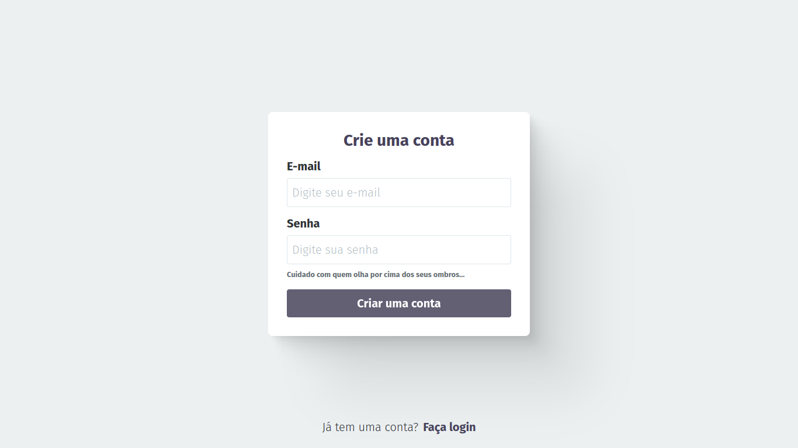
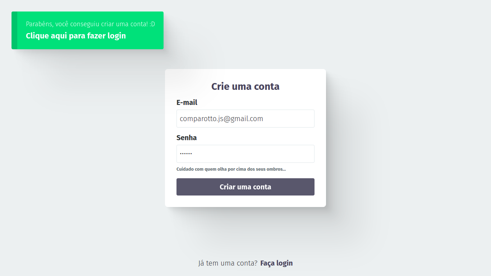
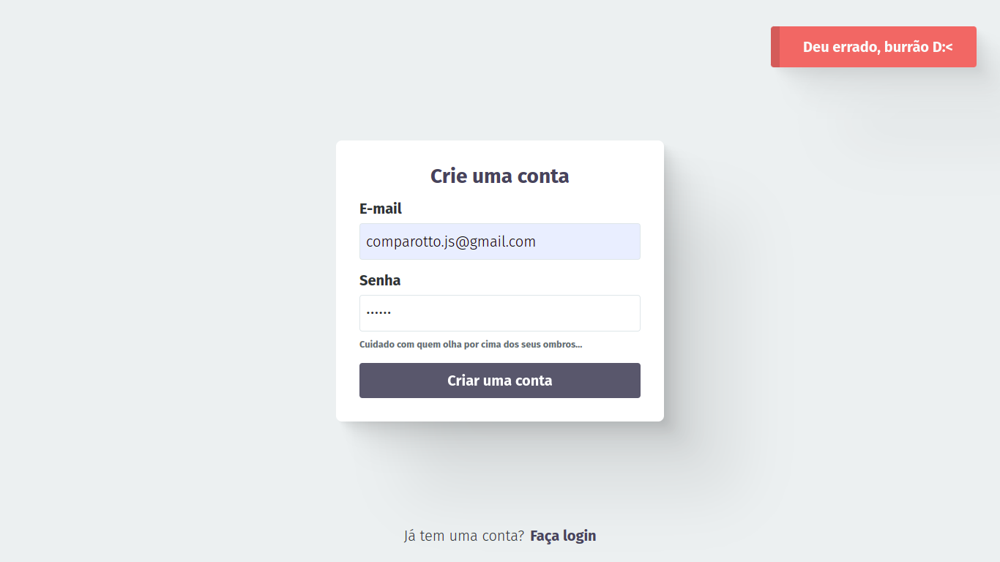
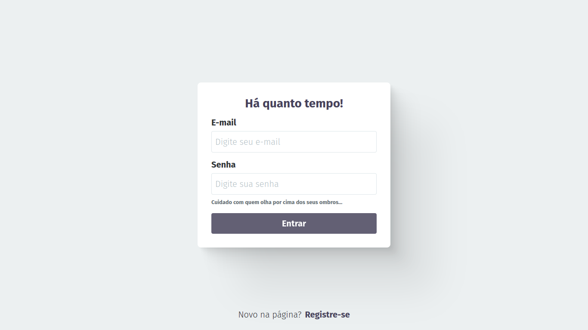
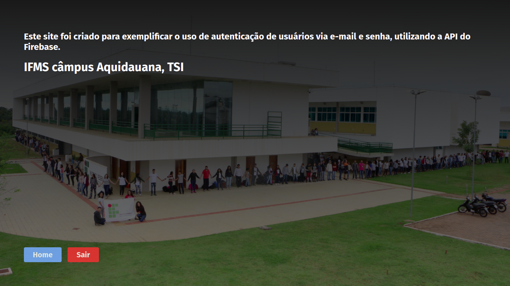

# autenticator

Este projeto utiliza a [API do Firebase](https://firebase.google.com/docs/auth?hl=pt-br) para autenticar usuários via e-mail e senha e foi feito apenas com HTML, CSS e TypeScript.

## Galeria

